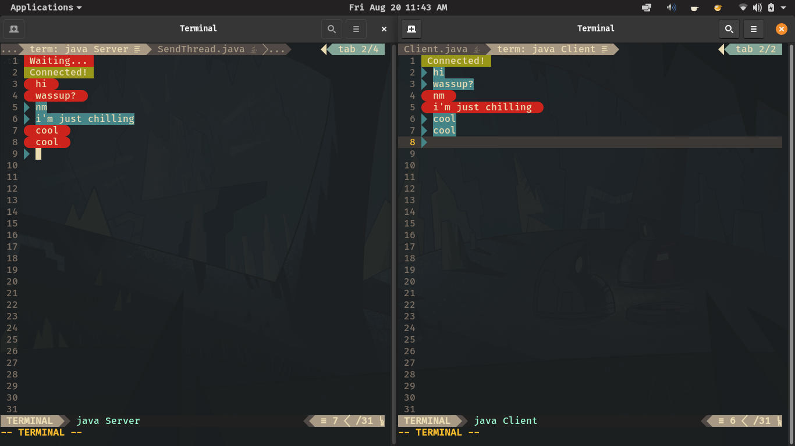

<!-- --- -->
<!-- title: 'TermChat' -->
<!-- author: 'Akansh Bharadwaj' -->
<!-- header-includes: -->
<!-- - \usepackage{setspace} -->
<!-- - \singlespacing -->
<!-- - \usepackage{paralist} -->
<!-- - \let\itemize\compactitem -->
<!-- --- -->


Client.java :

- code :

```java
import java.net.Socket;
import java.net.InetAddress;

public class Client {
	final static String BG_RED = "\033[41m";
	final static String BG_GRN = "\033[42m";
	final static String CLR = "\033[0m";

	public static void main (String [] args) {
		try {
			var socket = new Socket(
					InetAddress.getLocalHost(), 59059
					);
			System.out.println(BG_GRN+" Connected! "+CLR);

			var sender = new SendThread(socket);
			var reciever = new RecieveThread(socket);

			reciever.start();
			sender.start();

		} catch (Exception e) {
			System.out.println(e.getMessage());
		}
	}
}
```


RecieveThread.java :

- code :

```java
import java.util.Scanner;
import java.io.PrintWriter;
import java.net.Socket;

public class RecieveThread extends Thread {
	final static String BG_RED = "\033[41m";
	final static String BG_BLU = "\033[44m";
	final static String RED = "\033[31m";
	final static String BLU = "\033[34m";
	final static String WHT = "\033[97m";
	final static String CLR = "\033[0m";

	Socket target = null;
	Scanner in = new Scanner(System.in);
	Scanner tcp_in = null;

	public RecieveThread (Socket s) {
		this.target = s;
	}

	private void makeConnection() {
		try {
			this.tcp_in = new Scanner(
					target.getInputStream()
					);
		} catch (Exception e) {
			System.out.println(e.getMessage());
		}
	}

	@Override
	public void run () {
		this.makeConnection();
		while (true) {
			String msg = tcp_in.nextLine();
			if(msg.contains("/end")) {
				System.out.println("Thank you for using TermChat");
				this.stop();
			}
			System.out.print(CLR+"\033[k\n");
			System.out.println(msg);
			System.out.print(BLU+" "+BG_BLU+WHT);
		}
	}
}
```


SendThread.java :

- code :

```java
import java.util.Scanner;
import java.io.PrintWriter;
import java.net.Socket;

public class SendThread extends Thread {
	final static String BG_RED = "\033[41m";
	final static String BG_BLU = "\033[44m";
	final static String RED = "\033[31m";
	final static String BLU = "\033[34m";
	final static String WHT = "\033[97m";
	final static String CLR = "\033[0m";

	Socket target = null;
	Scanner in = new Scanner(System.in);
	PrintWriter tcp_out = null;

	public SendThread (Socket s) {
		this.target = s;
	}

	private void makeConnection() {
		try {
			this.tcp_out = new PrintWriter(
					target.getOutputStream(),true
					);
		} catch (Exception e) {
			System.out.println(e.getMessage());
		}
	}

	public static String sendPad(String s) {
		return "\033[k\n"+RED+""+WHT+BG_RED+" "+s+" "+CLR+RED+""+CLR;
	}

	@Override
	public void run () {
		this.makeConnection();
		while (true) {
			System.out.print(BLU+" "+BG_BLU+WHT);
			String str = in.nextLine();
			System.out.print(CLR);
			if (str.contains("/close")){
				tcp_out.println(sendPad(str));
				System.out.println("Thank you for using TermChat");
				this.stop();
			}
			tcp_out.println(sendPad(str));
		}
	}
}
```


Server.java :

- code :

```java
import java.net.ServerSocket;

public class Server {
	final static String BG_RED = "\033[41m";
	final static String BG_GRN = "\033[42m";
	final static String CLR = "\033[0m";

	public static void main (String [] args) {
		try {
			var listener = new ServerSocket(59059);
			System.out.println(BG_RED+" Waiting... "+CLR);
			var socket = listener.accept();
			System.out.println(BG_GRN+" Connected! "+CLR);

			var sender = new SendThread(socket);
			var reciever = new RecieveThread(socket);

			sender.start();
			reciever.start();

			listener.close();
		} catch (Exception e) {
			System.out.println(e.getMessage());
		}
	}
}
```


- output:



